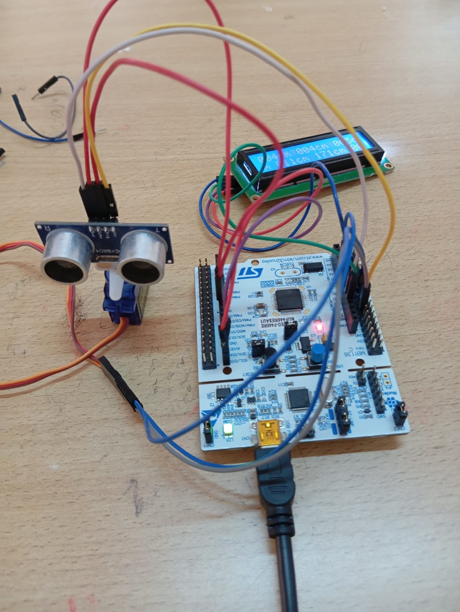

# 🧱 System Architecture

## 1. Overview
The STM32 Radar System is composed of a servo motor, ultrasonic sensor, and LCD display controlled by an STM32 Nucleo-64 board. The system performs real-time scanning to detect obstacles and display distance information.

## 2. Hardware Architecture 

## 3. Data Flow
1. Servo rotates between 0° and 180°  
2. At each angle, HC-SR04 measures distance  
3. STM32 processes measurement via HAL  
4. Distance and angle appear on LCD  

## 4. Software Architecture
- **Timers (TIMx)** → PWM for servo  
- **GPIO** → Trigger & Echo for ultrasonic  
- **SysTick / Delay** → Measurement timing  
- **LCD driver** → 4-bit communication  
- **Main Loop**  
  - Rotate servo  
  - Measure distance  
  - Display data  

